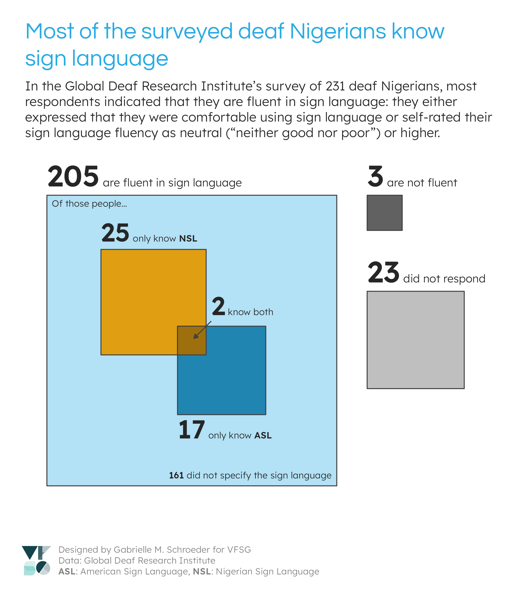
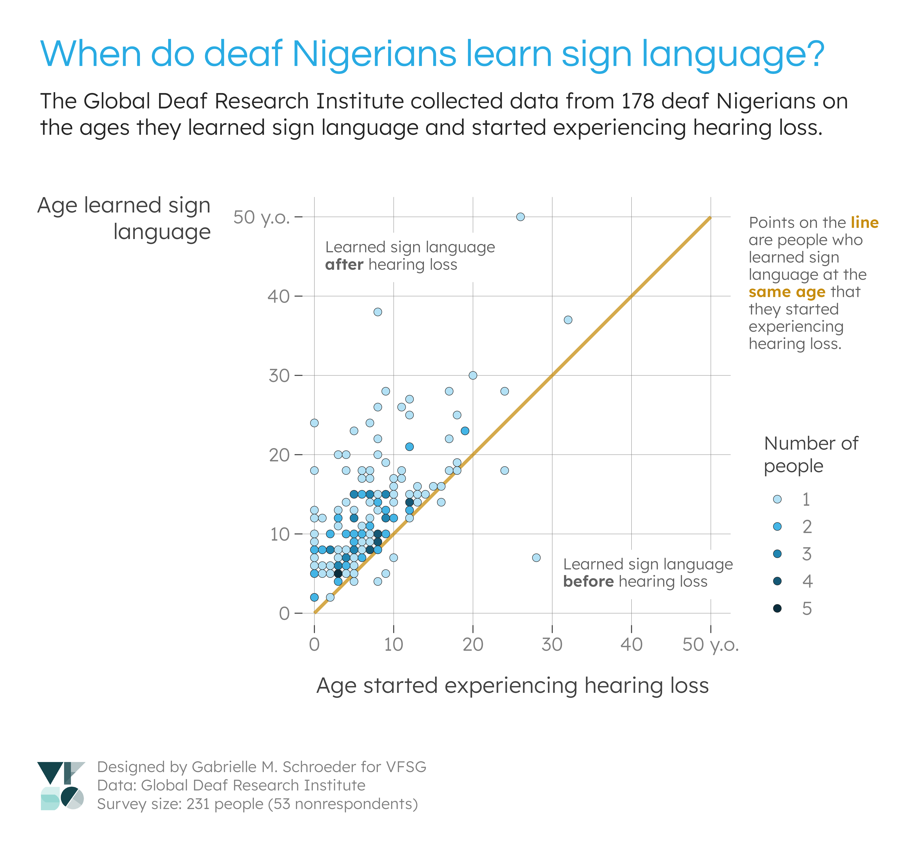
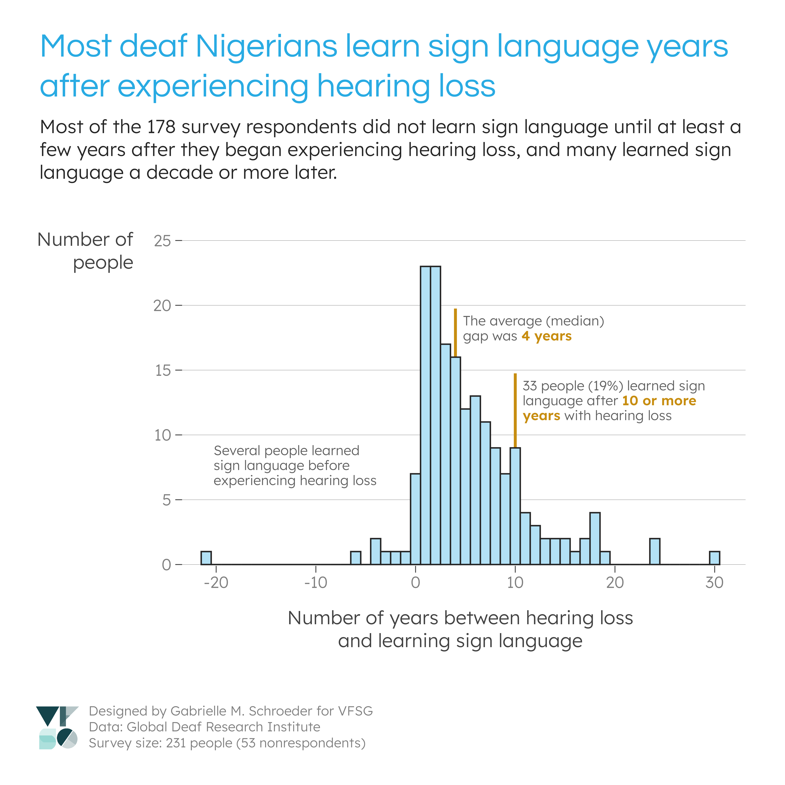

# Viz for Social Good Project: Global Deaf Research Institute

I made these visualisations for the [May 2024 Viz for Social Good project](https://www.vizforsocialgood.com/join-a-project/2024/global-deaf-research-institute) for the [Global Deaf Research Institute](https://www.globaldeafresearch.org/) (GDRI). GDRI asked for assistance with visualising data from an extensive pilot survey administered to over 200 deaf Nigerians.

## Visualisations

<kbd>
  
</kbd>

<kbd>
  
</kbd>

<kbd>
  
</kbd>

## Data story

GDRI's survey contained over 100 questions with variable response rates. I chose to focus on some of the questions about sign language use and fluency. I was initially curious about whether sign language fluency impacted factors like quality of life or ease of communication (e.g., with healthcare professionals). However, after an initial data exploration I found that most of the respondents were fluent in sign language, and I did not think there was sufficient data on non-sign language users to answer these questions.

Instead, I decided to focus on some other interesting observations from my analysis of the sign language variables: 1) the large proportion of sign language users (first visualisation), and 2) the gap between hearing loss and learning sign language (second and third visualisations). I also thought that these visualisations would be informative for refining future survey questions (see "Data recommendations"). 

## Design decisions

GDRI expressed a need for visualisations for multiple scenarios (e.g., communicating with stakeholders, presentations, funding bids). I therefore decided to make a series of smaller visualisations, rather than one large visualisation, to give GDRI more flexibility with how they use the visualisations. The layouts also allow my title and caption to be cropped out if GDRI would like to provide different context. Likewise, I stuck with a white background to make it easier to embed the visualisations in reports, presentations, and any printed materials.

I used GDRI branding from their logo and website. I used their main colours (sky blue and dark greys) for most of the visual elements and selected a constrasting accent colour (dark mustard yellow) based on some of the photos on their website. The titles use their website font, Questrial. I paired this font with Lexend, which (to my beginner typographer eyes) shares many similar features with Questrial. Lexend has more open aperatures than Questrial, however, making it easier to read at small font sizes, and it's also generally designed for accessibility. Lexend also has more available font weights than Questrial, which is useful for emphasising subsets of text in annotations.

## Data recommendations

Since this data was collected as part of a pilot survey, GDRI also asked VFSG volunteers to share any recommendations for future data collection. After working with this data, I have a few recommendations:
1) **Language options:** GDRI's survey asked an open-ended question, "Languages you use comfortably." Interestingly, 94 (!) respondents who expressed high levels of sign language fluency ("good" or "very good") did *not* list a sign language in their languages. Respondents may have interpretted this question as "*Spoken/written* languages you use comfortably", used terms such as "English" to refer to both spoken and signed languages, or interpretted "comfortable" in a way besides fluency (e.g., they may be uncomfortable using sign language due to discrimination). Additionally, many sign language users did not specify the sign language. Therefore, to get a more complete list of languages that respondents can use, I would suggest providing a set of checkboxes for the region's common spoken and signed languages in the survey. This format would also make the responses consistent and therefore easier to analyse.
2) **Clear indication of not knowing sign language**: The survey had no clear indication of whether a respondent did not know sign language. Because many people fluent in sign language did not list a sign language in their languages, the absence of a sign language in this list was not evidence for *not* knowing sign language. The sign language fluency question provides a better indication, but respondents who don't know sign language could potential skip this question if they think it only pertains to sign language users. Providing the discrete language options, as suggested above, would provide stronger evidence for not knowing sign language, and a question such as "Do you know any sign language?" may also be a useful addition.
3) **Want to learn sign language:** GDRI also asked respondents whether they wanted to learn sign language. Although "I already know sign language" was a possible option, many people with high levels of sign language fluency answered "yes" or "no", which is difficult to interpret (Are they expressing that they want to learn additional sign languages? Are they communicating that they want*ed* to learn sign language at an earlier time?). This question may need to be re-phrased or restricted to a subset of respondents (i.e., those who respond "no" to a direct question on whether they know sign language). 
4) **Hearing loss vs. "significant" hearing loss:** I observed a gap between when people began experiencing loss and when they learned sign language. One possible explanation is that the respondents could have had gradual hearing loss that did not initially require them to learn sign language for communication. I suspect this explanation is unlikely since many respondents began losing hearing at young ages, but a more definitive answer could be provided by additional data on respondents' hearing loss. Namely, if this trend is interesting to GDRI's researchers, it would be useful to know at what age the respondents had "significant" hearing loss according to some measure (e.g., no longer able to understand spoken language). 
5) **Demographics:** During the project kick-off, GDRI emphasised that there are different deaf populations with different experiences and needs. For example, some people are born deaf and learn sign language at an early age, while others experience gradual hearing loss as they age and are not culturally deaf. These visualisations revealled that most of the survey respondents were sign language users who experienced hearing loss in infancy, childhood, or adolescence. As such, the conclusions from this survey will be specific to this demographic. In future surveys, GDRI could focus on this demographic or experiment with different recruitment methods to survey individuals with different characteristics.

## Code

All visualisations were made using the R programming language.

Code dependencies:
- [GDRI data](https://www.vizforsocialgood.com/join-a-project/2024/global-deaf-research-institute) (add to the `data` folder)
- Font files for [Questrial](https://fonts.google.com/specimen/Questrial) and [Lexend](https://fonts.google.com/specimen/Lexend). Functions in `lib/lib_theme.R` that use these files have an optional argument for specifying the path to your local directory that contains font files.
